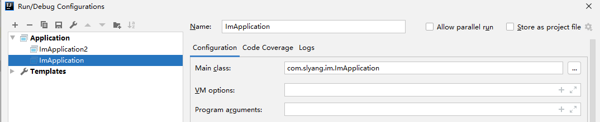
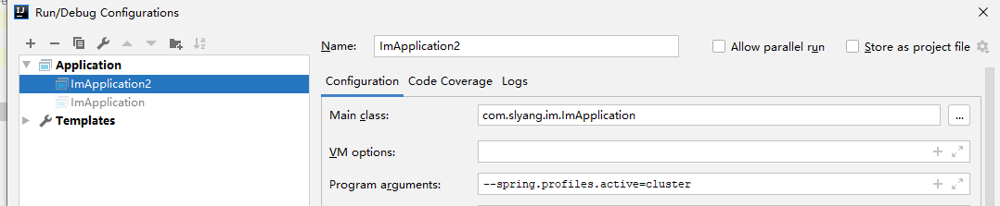

SocketIO Server base [Netty-socketio](https://github.com/mrniko/netty-socketio)
===
cluster base on redis

```
env jdk8, gradle6.x

```

#  启动2个服务


```
app1  im端口 9202
app2  im端口 9203
依赖redis 自行修改.
```

#   打开聊天窗口

```
link1: port_9092_user_159.html   连接上app1，用户为159
link2: port_9093_user_160.html   连接上app2, 用户为160
```

#  验证
```
用2个不同的浏览器打开2个网页，让sid不同  ( 或。客户端连接的时候用用户id区分sid 标识不同的连接用户)

用户为159,160 链接在不同的服务
2个用户相互发送消息，用户能正常接收。
```

